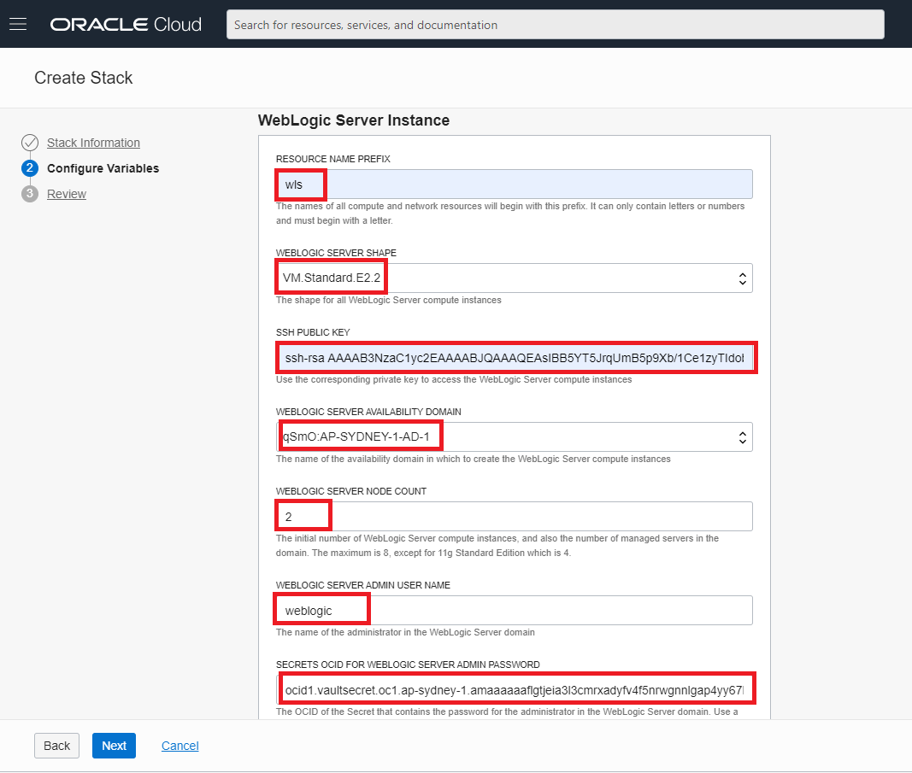

# Welcome to Oracle WebLogic Move and Improve Hands On Lab

## About this hands-on Hands On Lab ##

This Hands On Lab main purpose is to show how to do move and improve of existing WebLogic Domain so that WebLogic's user will be able to experience WebLogic's improvement on Oracle Cloud Infrastructure and Marketplace. This hands on lab is made based on the [WebLogic Cloud Workshop](https://github.com/StephaneMoriceau/WebLogic-Cloud-Workshop/) also various references and has been tested by July 2020. If you have any questions or inquiries please email me to lambertus.wardana@oracle.com.

## Prerequisites

- [Oracle Cloud Infrastructure](https://cloud.oracle.com/en_US/cloud-infrastructure) enabled account. The tutorial has been tested using [Trial account](https://myservices.us.oraclecloud.com/mycloud/signup)
- Basic understanding on Oracle WebLogic and Linux.

### 1. Create User

Create a user in IAM for the person or system who will be calling the API, and put that user in at least one IAM group with any desired permissions. See Adding Users. **You can skip this step if you want to run this lab as the user you are currently logged in.**

### 2. Create Vault

Generate a Vault to store our encryption key and the secret that will be used as WebLogic admin password, first we need to access the hamburger menu in the top left scroll down until you can find **Security** and choose **Vault**

Make sure you are in the same compartment where you will install the WebLogic

Input the desired Vault name

Click create and that's it.

### 3. Create Encryption Key

After creating Vault we need to create the master encryption key, by clicking the newly created vault, scroll down a bit until you can find master encryption key

Make sure correct compartment then click create key

In above page input the name of your encryption key and choose the encryption algorithm and length after that click create and done

### 4. Create Secret

Create a secret which will be used as WebLogic admin password, first go the Vault that created in Step 2 then scroll down until you find Secrets and click Create Secret

Make sure correct compartment

In the above input the desired secret name and decide which compartment that will be used (must use the same compartment of WebLogic). Then choose the master encryption key that we created in Step 3 and insert your plain password as plain-text then click create.

After finish creating you click the newly created secret and click copy for the OCID that will be used later during WebLogic creation.

### 5. Provision a Domain in WebLogic Cloud from the OCI Markeplace

**Launch a Stack**

Sign in to Marketplace and specify initial stack information.

1. Sign in to the Oracle Cloud Infrastructure Console.

2. Click the  Navigation Menu icon and select Marketplace.

3. You can choose to browser-search for WebLogic Cloud, or for faster search you can apply the filters:

Type: Stack
Publisher: Oracle
Category: Application Development

3. Choose **WebLogic Cloud Enterprise Edition BYOL**; This brings you to the Stack Overview page:

4. Select a version of Oracle WebLogic Server 12c.
If there's more than one 12c patch, the latest patch is the default.

5. Select the compartment **"WLS_Compartment"** in which we will create the stack.

By default the stack compartment is used to contain the domain compute instances and network resources. If later on you specify a network compartment on the Configure Variables page of the Create Stack wizard, then only the compute instances are created in the stack compartment that you select here.

6. Select the Terms and Restrictions check box, and then click Launch Stack.

The Create Stack wizard is displayed.

**Specify Stack Information**

Specify the name, description, and tags for the stack.

8. On the Stack Information page of the Create Stack wizard, enter a name for your stack.

9. Enter a description for the stack (optional).

10. Specify one or more tags for your stack (optional).

11. Click Next.

The Configure Variables page opens.

**Configure WebLogic Instance Parameters**

Specify the parameters needed to configure the WebLogic instance domain.

12. In the WebLogic Server Instance section, enter the resource name prefix.(The maximum character length is 8.
This prefix is used by all the created resources.)

13. Select the WebLogic Server shape for the compute instances: **VM.Standard2.1**. (Fyi, only the following shapes are supported: VM.Standard2.x, VM.Standard.E2.x, BM.Standard2.x, BM.Standard.E2.x 

14. Enter the SSH public key. (See section #4)

15. Select the availability domain where you want to create the domain.**Choose one of the displyed ADs**

16. Select the number of managed servers you want to create. **Select 2**
The managed servers will be members of a cluster, unless you selected WebLogic Server Standard Edition.

17. Enter a user name for the WebLogic Server administrator. **Enter weblogic**

18. Enter an encrypted password for the WebLogic Server administrator. **Enter the value of Encrypted-data in the output of the terraform apply command that you run in section #7**

**Configure Advanced Parameters for a Domain**

19. Don't change / select WebLogic Server Instance Advanced Configuration

20. Network Compartment: Select **WLS_compartment**

21. VCN Strategy: Select **Create New VCN**

22. WLS Network: Enter **WLSCloudVCN** 

23. WLS Network CIDR: Keep the default

24. Subnet Strategy: Select **Create New Subnet**

25. Subnet Type: Keep the default **Use Public Subnet** selection.

26. Subnet span: Select **Regional Subnet**

27. Select **Provision Load Balancer**

28. LB Network CIDR: Keep the default

29. LB Shape: Select **400Mbps**

30. Do **NOT** select **Prepare Load Balancer for https**

31. Do **NOT** select **Enable authentification using Identity Cloud Service**

32. Database Strategy: keep the default **No Database**

33. At the bottom of the Configure Variables page, click **Next**

You are now ready to create the stack.

34. Review the Stack configuration and Click **Create**

35. A Stack Job is being run and our WLS Server is being provisioned

36. While all resources being created we can check the Job Logs; it helps fixing potentially configuration errors if the provisioning fails

37. After a while (~ 15 minutes), the Job should complete with success

38. We can check the Outputs section of Job Resources and check for two important values:

- Sample Application URL
- WebLogic Server Administration Console

39. Let's check the WLS admin console of the newly created WebLogic Server

- As we have chosen a Public Subnet for the WLS network, both Compute instances that have been created have public IPs associated.
- In a new browser window, enter the **URL** as displayed in **WebLogic Server Administration Console**
- Login with weblogic username (weblogic) and the **plain text password** you selected in section #3

40. We can see that our domain has one admin server and two managed servers:

41. Let's check the WLS sample-app deployed in the newly created WebLogic Server

- In a new browser window, enter the **URL** as displayed in **WebLogic Server sample application**

42. We can check the Compute Instances to see what has been provisioned 

From  choose Core Infrastructure -> Compute -> Instances:

43. We can see two instances having our prefix mentioned during Stack configuration; one of them runs the admin server and a managed server and the other runs the second managed server:

**Congratulations! Your WLS domain is up & running!**
